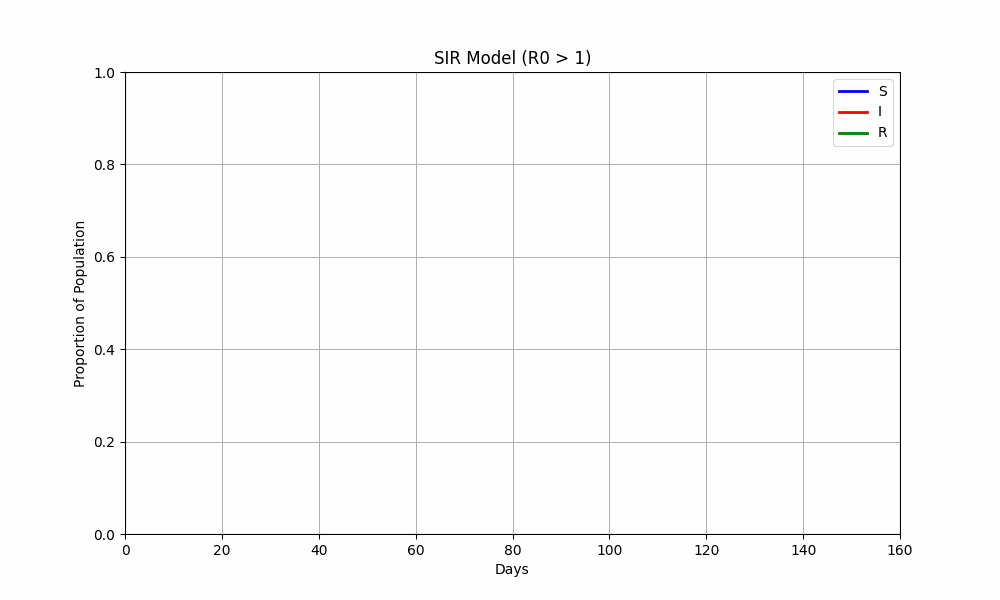
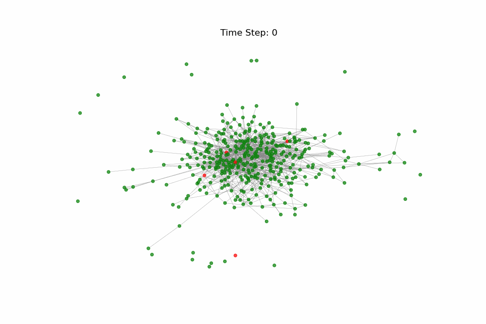

# Disease Modeling

This repository models the spread of diseases using the SIR (Susceptible-Infected-Recovered) and SEIR (Susceptible-Exposed-Infected-Recovered) models. It provides insights into how infectious diseases propagate and can be managed within populations. Each folder includes `.ipynb` simulation files and formal reports detailing the findings.

## Disease Modeling with SIR and SEIR Models

This section applies Python to simulate disease dynamics using the SIR and SEIR models. It explores transmission and recovery processes, showing how different disease parameters affect population health. Simulations include oscillatory behaviors and phase portraits to visualize disease spread under varying conditions.

  
   
  <em>Figure 1: Simulation of disease dynamics over time using the SIR model with demography.</em>

## Advanced Topics in Epidemiological Modeling

This section covers advanced topics like stochastic processes, parameter sensitivity analysis, and their impact on disease dynamics. It delves into stochastic resonance, transient dynamics, network-based models, and vaccination strategy simulations. Detailed simulations and visualizations offer a deep understanding of the complex interactions that govern infectious disease spread.

  
   
    <em>Figure 2: Visualization of disease dynamics on a network, illustrating how infection spreads through interconnected nodes over time.</em>

Explore each folder for code, simulations, and detailed reports.
